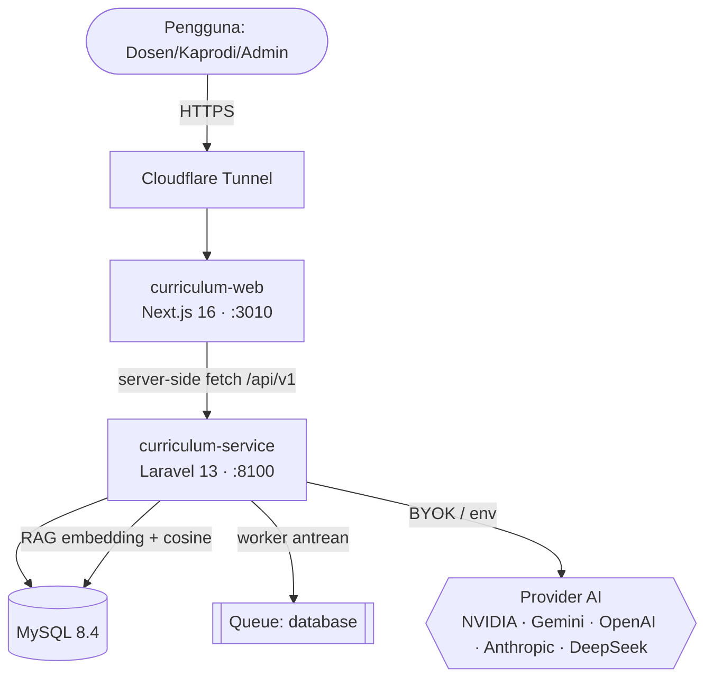
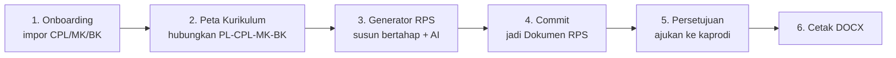

# Aplikasi RPS OBE — Penyusun Kurikulum & RPS dengan AI Co‑Pilot

Aplikasi web multi‑tenant untuk menyusun **kurikulum** dan **Rencana Pembelajaran Semester (RPS)** yang selaras dengan prinsip **Outcome‑Based Education (OBE)**, dilengkapi **AI co‑pilot** yang membantu menyusun (bukan menggantikan) dosen, dengan pengaman **anti‑halusinasi (grounding)** ke dokumen rujukan resmi (SN‑Dikti/KKNI, panduan KPT, standar akreditasi).

> **Aplikasi live:** https://rps.pharm.web.id
> **Status:** Produksi (tahap uji coba sebelum mengaktifkan model AI produksi).

---

## Daftar Isi

1. [Ringkasan Produk](#1-ringkasan-produk)
2. [Konsep OBE Singkat](#2-konsep-obe-singkat)
3. [Arsitektur Sistem](#3-arsitektur-sistem)
4. [Struktur Repositori](#4-struktur-repositori)
5. [Fitur per Modul](#5-fitur-per-modul)
6. [Panduan Pengguna](#6-panduan-pengguna)
7. [Peran & Hak Akses](#7-peran--hak-akses)
8. [Lapisan AI (Simulasi vs Produksi)](#8-lapisan-ai-simulasi-vs-produksi)
9. [Menjalankan Secara Lokal](#9-menjalankan-secara-lokal)
10. [Deploy Produksi](#10-deploy-produksi)
11. [Dokumentasi Teknis Lanjutan](#11-dokumentasi-teknis-lanjutan)

---

## 1. Ringkasan Produk

Aplikasi ini adalah **Curriculum Service** — sumber kebenaran (source of truth) untuk data kurikulum dan RPS OBE sebuah program studi. **Ini bukan LMS**; ia menyediakan RPS sebagai artefak resmi yang kelak dikonsumsi oleh sistem pembelajaran (LMS) terpisah.

**Masalah yang dipecahkan:**

- Menyusun RPS OBE yang benar‑benar *selaras* (Profil Lulusan → CPL → CPMK → Sub‑CPMK → rencana mingguan → penilaian) itu rumit dan memakan waktu.
- Penjejakan keterkaitan (traceability) antar elemen OBE sering hilang.
- AI generatif rawan "mengarang" aturan/standar yang tidak ada.

**Solusi:**

- Pemetaan kurikulum berbasis matriks (Profil Lulusan × CPL, Bahan Kajian × CPL, Mata Kuliah × CPL, dst.) dengan saran AI.
- Generator RPS **bertahap dengan checkpoint manusia** — AI tidak membuat seluruh RPS sekaligus.
- **Validator anti‑halusinasi**: setiap klaim normatif diverifikasi ke dokumen rujukan resmi (RAG). Klaim tanpa bukti untuk kategori ketat (regulasi/akreditasi/asosiasi profesi) ditolak.
- Alur persetujuan (dosen → kaprodi), cetak RPS (DOCX), dan monitoring biaya/penggunaan AI.

---

## 2. Konsep OBE Singkat

Rantai keterkaitan OBE yang ditegakkan aplikasi:

```
Profil Lulusan (PL)
      │  (matriks PL × CPL)
      ▼
Capaian Pembelajaran Lulusan (CPL) ──┐
      │                              │ (matriks Bahan Kajian × CPL)
      │ (matriks MK × CPL)           ▼
      ▼                        Bahan Kajian (BK)
Mata Kuliah (MK)
      │
      ▼
CPMK (Capaian Pembelajaran Mata Kuliah)  ── bobot kontribusi ke CPL
      │
      ▼
Sub‑CPMK  ── Indikator (terukur, kata kerja sesuai Taksonomi)
      │
      ▼
Rencana Mingguan (16 minggu) + Komponen Penilaian + Rubrik
      │
      ▼
Capaian Mahasiswa → Evaluasi CPL → Tindak Lanjut  (menutup siklus OBAEI)
```

**Catatan regulasi:** Kategori CPL (Sikap / Pengetahuan / Keterampilan Umum / Keterampilan Khusus) bersifat **opsional**. Aplikasi mendukung gaya lama (S/P/KU/KK per Permendikbud 3/2020) maupun gaya CPL terintegrasi (Permendikbudristek 53/2023).

---

## 3. Arsitektur Sistem



**Prinsip kunci:**

- **Tanpa CORS.** Semua panggilan ke backend dilakukan **server‑side** dari Next.js (server components + server actions). Browser tidak pernah memanggil API langsung.
- **Multi‑tenant.** Setiap tabel inti punya `institusi_id`.
- **Aksi berat = asinkron** (antrean database) karena Cloudflare Tunnel time‑out ±100 detik (mis. indexing dokumen rujukan).
- **RAG di aplikasi.** Embedding disimpan sebagai JSON di MySQL; kemiripan dihitung dengan cosine similarity di PHP (bukan pgvector).

**Stack:**

| Lapisan | Teknologi |
|---|---|
| Frontend | Next.js 16.2 (App Router, standalone), React 19, Tailwind CSS v4, TypeScript |
| Backend | Laravel 13 (PHP 8.4), Sanctum (bearer token), spatie/laravel-permission |
| Database | MySQL 8.4 |
| Antrean | Queue driver `database` (worker via supervisord di container `api`) |
| Cetak | PhpWord (DOCX), smalot/pdfparser (ekstraksi dokumen rujukan) |
| Proxy/TLS | Cloudflare Tunnel (default) atau Caddy (opsional) |
| Kontainer | Docker Compose (db + api + web + tunnel) |

---

## 4. Struktur Repositori

```
Aplikasi RPS/
├── curriculum-service/     # Backend API (Laravel) — sumber kebenaran data
├── curriculum-web/         # Frontend (Next.js) — antarmuka pengguna
├── benchmark-harness/      # Alat benchmark internal (uji performa/biaya AI)
├── rps-obe-builder/        # Prototipe builder (Vite/TS) — eksperimen awal
├── docker-compose.prod.yml # Orkestrasi deploy produksi (1 VM)
├── Caddyfile               # Konfigurasi proxy Caddy (opsional)
├── Blueprint-Final-Lengkap.md          # Blueprint fungsional lengkap
├── Konsep-LMS-OBE-AI-Copilot.md        # Konsep & roadmap ekosistem
└── 9-ERD-master.mermaid                # ERD basis data
```

Dua komponen utama yang berjalan di produksi adalah **`curriculum-service`** dan **`curriculum-web`**. Dokumentasi teknis masing‑masing ada di README di dalam foldernya.

---

## 5. Fitur per Modul

| Modul | Nama | Ringkas |
|---|---|---|
| 0 | **Onboarding & Column‑Mapping** | Impor CPL/MK/Bahan Kajian dari CSV/Excel dengan pemetaan kolom otomatis. |
| 0a | **Dokumen Rujukan (RAG)** | Unggah dokumen resmi (KPT, SN‑Dikti, standar akreditasi) → dipecah menjadi *chunk* + embedding untuk grounding AI. |
| 0b | **Checklist Penyelarasan Acuan** | Cocokkan PL/CPL/BK ke butir acuan; tandai yang belum terpenuhi + rekomendasi. |
| 1 | **Peta Kurikulum** | Matriks keterkaitan PL×CPL, BK×CPL, MK×CPL, MK×BK + traceability + saran AI. |
| 1 | **Konfigurasi Aturan & Taksonomi** | Aturan konversi SKS→jam, master taksonomi Bloom/Krathwohl/Dave + kata kerja operasional. |
| 2 | **Generator RPS** | Penyusunan bertahap (CPMK → Sub‑CPMK → Mingguan → Penilaian) dengan checkpoint + validator anti‑halusinasi. |
| 2 | **Dokumen RPS** | Versi RPS resmi hasil commit; cetak DOCX; traceability OBE. |
| 3 | **Validator Overlap** | Deteksi keterampilan yang diklaim lebih dari satu MK. |
| 4 | **Persetujuan** | Alur pengajuan/persetujuan/revisi RPS (dosen → kaprodi) + audit trail. |
| 6 | **OBAEI** | Evaluasi ketercapaian CPL dari capaian mahasiswa + tindak lanjut. |
| 8 | **Tata Kelola** | Dashboard biaya/penggunaan AI, audit log, notifikasi. |
| — | **Pengaturan AI & Prompt** | Ganti profil model (simulasi/produksi) dan override prompt tanpa deploy. |
| — | **Administrasi** | Kelola Prodi/Unit, Pengguna, Peran & Hak Akses (RBAC). |

---

## 6. Panduan Pengguna

### Masuk (Login)

1. Buka https://rps.pharm.web.id.
2. Masuk dengan **NIDN** dan kata sandi Anda. (Akses **wajib HTTPS**.)
3. Menu yang tampil di sidebar menyesuaikan **peran & hak akses** Anda.

### Alur kerja tipikal menyusun RPS



1. **Onboarding** — Impor data CPL, Mata Kuliah, dan Bahan Kajian ke kurikulum tujuan (tempel CSV atau unggah Excel). Sistem menyarankan pemetaan kolom otomatis; Anda tinggal mengonfirmasi.
2. **Peta Kurikulum** — Buka kurikulum, isi matriks keterkaitan (PL×CPL, MK×CPL, dst.). Klik **"Saran AI"** untuk mendapat usulan tautan; setujui/tolak. Cek tab **Traceability** untuk menemukan CPL "yatim" (belum diampu MK mana pun).
3. **Generator RPS** — Menu *Generator RPS* → **"+ Sesi Baru"** → pilih mata kuliah. Susun bertahap:
   - **CPMK** → tinjau/sunting → **Setujui**
   - **Sub‑CPMK + Indikator** → tinjau → **Setujui**
   - **Rencana Mingguan (16 minggu)** → tinjau → **Setujui**
   - **Komponen Penilaian + Rubrik** → tinjau → **Setujui**

   Setiap tahap dibantu AI (tombol *Generate*/*Regenerasi*) dan diperiksa validator anti‑halusinasi. Anda bisa **Sematkan** (pin) bagian yang sudah final agar tidak berubah saat regenerasi. Butuh diskusi? Buka **chat konsultan AI** (tombol mengambang) atau jalankan **Audit** keselarasan.
4. **Commit** — Setelah semua tahap disetujui, klik **Commit** untuk menjadikannya **Dokumen RPS** resmi (bisa dicetak & diajukan).
5. **Persetujuan** — Di halaman Dokumen RPS, **Ajukan** ke kaprodi. Kaprodi **Setujui** atau **Revisi** (dengan catatan). Semua terekam di audit trail.
6. **Cetak** — Unduh RPS sebagai **DOCX** dengan format seragam (template dapat diatur di menu *Template RPS*).

### Menghapus sesi / dokumen

- **Sesi Generator** dapat dihapus dari daftar Generator (tombol *Hapus*). Ini hanya membuang draf; RPS yang sudah di‑commit tetap aman.
- **Dokumen RPS** dapat dihapus dari daftar Dokumen RPS (tombol *Hapus*). Rencana mingguan & komponen penilaian pada versi tersebut ikut terhapus (tidak dapat dibatalkan).

### Profil saya

Klik nama/avatar di header untuk mengubah nama, email, atau kata sandi. NIDN dan peran hanya dapat diubah oleh admin.

---

## 7. Peran & Hak Akses

Otorisasi memakai **RBAC** (spatie/laravel-permission). Setiap item menu punya izin (`*.view`, `*.manage`). Peran & izin dikelola di menu **Administrasi → Peran & Hak Akses**. Contoh peran umum: Admin, Kaprodi, Dosen, GPM/STPMP. Menu di sidebar otomatis tersembunyi jika peran tidak memiliki izinnya.

---

## 8. Lapisan AI (Simulasi vs Produksi)

AI dirutekan **per‑tugas** (generate, judge, validator, asistif, ekstraksi, embedding) melalui **profil** yang dapat diganti dari UI (**Pengaturan → Konfigurasi AI**) **tanpa deploy ulang**:

| Profil | Tujuan | Model (ringkas) |
|---|---|---|
| `produksi` | Kualitas terbaik | Generate: Claude Sonnet · Judge: GPT · Validator: GPT‑mini |
| `simulasi` | Murah/uji alur | Gemini + DeepSeek |
| `simulasi_nvidia` | **Gratis (trial NVIDIA NIM)** — profil aktif saat ini | Generate/Judge: gpt‑oss · Validator: Gemini Flash Lite (lintas‑provider) |

**Grounding / anti‑halusinasi** berjalan otomatis di pipeline generator:

1. Ekstrak klaim dari draf.
2. Cari bukti di dokumen rujukan (RAG: embedding + cosine).
3. Nilai (judge) klaim vs bukti dengan model **lintas‑provider** (validator ≠ generator).
4. Klaim tanpa bukti pada kategori ketat (regulasi nasional/akreditasi/asosiasi profesi) → **ditolak**; lainnya → revisi otomatis 1×.

> Untuk beralih ke produksi: ganti profil ke `produksi` di UI dan isi kredensial (Claude/GPT). Tidak perlu mengubah kode. Detail teknis lapisan AI ada di [`curriculum-service/README.md`](curriculum-service/README.md).

---

## 9. Menjalankan Secara Lokal

Butuh dua proses berjalan bersamaan: **backend** (`:8100`) dan **frontend** (`:3010`).

**Backend** — lihat [`curriculum-service/README.md`](curriculum-service/README.md):

```bash
cd curriculum-service
composer install
cp .env.example .env && php artisan key:generate
php artisan migrate --seed
php artisan serve --port=8100
```

**Frontend** — lihat [`curriculum-web/README.md`](curriculum-web/README.md):

```bash
cd curriculum-web
npm install
# .env.local → API_BASE_URL=http://127.0.0.1:8100/api/v1
PORT=3010 npm run dev
```

Buka http://localhost:3010.

---

## 10. Deploy Produksi

Satu VM menjalankan `db + api + web + tunnel` via Docker Compose. Berkas: [`docker-compose.prod.yml`](docker-compose.prod.yml). Semua rahasia diisi lewat `.env` di samping compose (jangan di‑commit).

```bash
# di VM
cd ~/rps-deploy/rps-obe
git pull --ff-only
docker compose -f docker-compose.prod.yml build api web
docker compose -f docker-compose.prod.yml up -d api web
```

- **Perubahan kode PHP** → `build api`.
- **Perubahan frontend** → `build web` (rewrites `/backend` dibakukan saat build).
- **Perubahan env saja** → cukup `up -d` (recreate, tanpa rebuild).

> **Penting:** hanya variabel yang terdaftar eksplisit di blok `environment:` compose yang sampai ke kontainer. Setiap kunci AI baru wajib ditambahkan di situ.

Akses publik melalui **Cloudflare Tunnel** (TLS diterminasi di edge). Alternatif TLS mandiri tersedia via profil Caddy: `docker compose --profile caddy up -d`.

---

## 11. Dokumentasi Teknis Lanjutan

- **Backend (API, model data, lapisan AI, endpoint):** [`curriculum-service/README.md`](curriculum-service/README.md)
- **Frontend (halaman, arsitektur fetch, build/deploy):** [`curriculum-web/README.md`](curriculum-web/README.md)
- **Blueprint fungsional:** [`Blueprint-Final-Lengkap.md`](Blueprint-Final-Lengkap.md)
- **Konsep & roadmap ekosistem/LMS:** [`Konsep-LMS-OBE-AI-Copilot.md`](Konsep-LMS-OBE-AI-Copilot.md)
- **ERD basis data:** [`9-ERD-master.mermaid`](9-ERD-master.mermaid)
