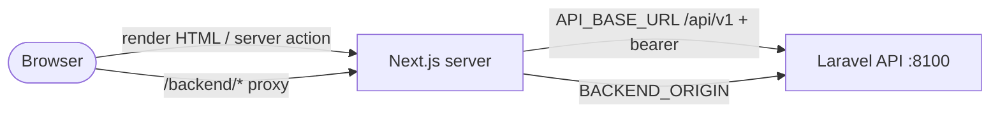

# curriculum-web — Frontend (Next.js)

Antarmuka pengguna aplikasi **RPS OBE**. Dibangun dengan **Next.js 16 (App Router)**, **React 19**, **Tailwind CSS v4**, dan **TypeScript**. Seluruh komunikasi ke backend dilakukan **server‑side** (tanpa CORS).

> Dokumentasi produk & panduan pengguna: lihat [README root](../README.md).
> Backend: lihat [`../curriculum-service/README.md`](../curriculum-service/README.md).

---

## Daftar Isi

1. [Stack](#1-stack)
2. [Setup Lokal](#2-setup-lokal)
3. [Variabel Lingkungan](#3-variabel-lingkungan)
4. [Arsitektur (Tanpa CORS)](#4-arsitektur-tanpa-cors)
5. [Struktur & Halaman](#5-struktur--halaman)
6. [Pola UI](#6-pola-ui)
7. [Build & Deploy](#7-build--deploy)
8. [Catatan Penting (Gotchas)](#8-catatan-penting-gotchas)

---

## 1. Stack

| Komponen | Versi |
|---|---|
| Next.js | 16.2.10 (App Router, `output: standalone`) |
| React | 19.2.4 |
| Tailwind CSS | v4 |
| TypeScript | 5 |
| Parser Excel | read-excel-file 9.2 (impor XLSX di browser) |

---

## 2. Setup Lokal

Backend harus hidup di `:8100` lebih dulu (lihat README backend).

```bash
cd curriculum-web
npm install

# buat .env.local:
echo "API_BASE_URL=http://127.0.0.1:8100/api/v1" > .env.local

PORT=3010 npm run dev
```

Buka http://localhost:3010.

Validasi cepat:

```bash
npx tsc --noEmit
npx eslint src/app/.../file.tsx
npm run build   # cek build produksi
```

---

## 3. Variabel Lingkungan

| Variabel | Fungsi | Catatan |
|---|---|---|
| `API_BASE_URL` | Basis panggilan server‑side ke API | mis. `http://127.0.0.1:8100/api/v1` (dev) / `http://api:8100/api/v1` (prod) |
| `BACKEND_ORIGIN` | Target proxy `/backend/*` (unduh DOCX/cetak) | **Dibakukan saat BUILD** ke `routes-manifest` (lihat §8) |
| `TURNSTILE_SITE_KEY` / `TURNSTILE_SECRET_KEY` | Cloudflare Turnstile di halaman login (opsional) | kosongkan untuk menonaktifkan |

---

## 4. Arsitektur (Tanpa CORS)

- **Semua fetch server‑side.** Server components memakai `apiGet`; server actions memakai `apiPost`/`apiPut`/`apiDelete` dari [`src/lib/api.ts`](src/lib/api.ts). Browser **tidak** memanggil API langsung.
- Semua helper mengembalikan `ApiResult { ok, status, data, message }`.
- **Auth:** token bearer disimpan di cookie `rps_token` (HttpOnly, Secure) dan disisipkan otomatis pada panggilan server. Akses **wajib HTTPS** — via HTTP cookie Secure tidak terkirim sehingga kembali ke login.
- **Unduhan/cetak** (DOCX, cetak RPS) diproksi lewat path `/backend/*` → `BACKEND_ORIGIN` (server‑to‑server).



---

## 5. Struktur & Halaman

```
src/
├── app/
│   ├── login/                 # halaman login (+ Turnstile opsional)
│   ├── dashboard/             # Beranda: KPI + daftar terbaru
│   ├── konfigurasi-aturan/    # aturan konversi SKS dll
│   ├── taksonomi/             # master taksonomi Bloom/Krathwohl/Dave
│   ├── dokumen-rujukan/       # unggah dokumen RAG (indexing asinkron)
│   ├── checklist-acuan/       # penyelarasan butir acuan
│   ├── kurikulum/             # Peta Kurikulum (+ [id] matriks & traceability)
│   ├── validasi-overlap/      # Validator Overlap
│   ├── generator/             # Generator RPS (list + [id] pipeline bertahap)
│   ├── rps/                   # Dokumen RPS (list + [id] detail + persetujuan)
│   ├── persetujuan/           # antrean persetujuan
│   ├── obaei/                 # evaluasi ketercapaian CPL
│   ├── governance/            # tata kelola: biaya, audit log, notifikasi
│   ├── pengaturan-ai/         # ganti profil AI + pemetaan model (tanpa deploy)
│   ├── prompts/               # override prompt AI
│   ├── template-rps/          # kelola template cetak DOCX
│   ├── prodi/  pengguna/  peran/   # Administrasi (Prodi/Unit, User, RBAC)
│   └── profil-saya/           # edit profil mandiri
├── components/
│   ├── shell.tsx              # sidebar + header (menu difilter per izin)
│   ├── ui.tsx                 # PageHeader, Card, Table, Badge, Pagination, buttonClass, ...
│   ├── modal.tsx              # Modal <dialog> + Field/SelectField/SubmitButton
│   └── toast.tsx              # ToastProvider + useToast()
└── lib/
    ├── api.ts                 # apiGet/apiPost/apiPut/apiDelete + tipe entitas
    └── use-action-result.ts   # useActionResult(state, {onSuccess, successMessage, refresh})
```

Navigasi sidebar dikelompokkan: **Umum · Acuan & Aturan · Kurikulum · RPS · Evaluasi & Monitoring · Pengaturan · Administrasi**. Setiap item punya `perm`; menu otomatis tersembunyi bila peran tak memilikinya.

---

## 6. Pola UI

- **Server component** untuk daftar/detail (fetch data), **client component** kecil untuk aksi (tombol + modal).
- **Form** memakai `useActionState` + server action, lalu `useActionResult(state, {...})` untuk toast & refresh.
- **Konfirmasi hapus** memakai `Modal` (`triggerVariant="danger"`) + tombol "Ya, hapus" (lihat contoh `rps/delete-button.tsx`, `generator/delete-button.tsx`).
- **Bahasa Indonesia** untuk seluruh teks UI; tanpa emoji.

---

## 7. Build & Deploy

Produksi berjalan sebagai image Docker (`output: standalone`). Rewrites `/backend` **dibakukan saat build** — perubahan `BACKEND_ORIGIN` butuh **build ulang** image `web`, bukan sekadar restart.

```bash
# di VM (dari root repo)
docker compose -f docker-compose.prod.yml build web
docker compose -f docker-compose.prod.yml up -d web
```

Setelah redeploy, halaman lama yang masih terbuka bisa error "Failed to find Server Action" (bundle lama) — lakukan **hard‑refresh** (Cmd/Ctrl+Shift+R).

---

## 8. Catatan Penting (Gotchas)

- **`BACKEND_ORIGIN` dibakukan saat build.** Dockerfile builder mengeset `ARG/ENV BACKEND_ORIGIN` sebelum `npm run build`; compose mengirim `build.args.BACKEND_ORIGIN=http://api:8100`. Salah set → proxy `/backend` mengarah ke `127.0.0.1:8100` → 500. Wajib `build web`.
- **Batas unggah** ada dua: `experimental.serverActions.bodySizeLimit` dan `experimental.proxyClientMaxBodySize` — keduanya diset `50mb` dan harus selaras dengan nginx/PHP/validasi Laravel.
- **Impor Excel:** `read-excel-file` v9 mengembalikan `Sheet[]` (`[{sheet, data}]`), bukan `Row[]` — sudah ditangani `unwrapSheets()`. CSV mendeteksi delimiter (`;`/tab/`,`) otomatis.
- **Tailwind v4** tidak lagi menyetel `cursor: pointer` pada tombol/input file — di‑patch global di `globals.css`.
- Semua teks UI **Bahasa Indonesia**, tanpa emoji.
